<a href="https://sherzod.net" aria-label="Open Sherzod Abdumutalov's portfolio">
  <picture>
    <source media="(prefers-color-scheme: dark)" srcset="./assets/profile-header-dark.svg">
    <source media="(prefers-color-scheme: light)" srcset="./assets/profile-header-light.svg">
    
  </picture>
</a>

# Sherzod Abdumutalov

**Software Development Team Lead**

[Portfolio](https://sherzod.net) &middot; [Stack](#technology-system) &middot; [Open Source](#open-source) &middot; [Contact](#contact)

Focused on backend engineering, software architecture, distributed systems, and GIS/data-intensive platforms. Technical leadership and product engineering connect these disciplines into coherent systems.

## Technology System

  

<strong>Backend systems</strong>

`Python` `Django` `Django REST Framework` `FastAPI`

API-oriented backend systems with explicit boundaries, domain decomposition, and maintainable service contracts.

<strong>Data and GIS</strong>

`PostgreSQL` `PostGIS` `Redis` `MongoDB`

Relational, geospatial, cache, and document data concerns shaped around data-intensive workflows.

<strong>Async and distributed</strong>

`Celery` `RabbitMQ` `REST APIs` `Event-driven systems`

Background processing and event-driven boundaries for asynchronous workflows and cross-system communication.

<strong>Product interfaces</strong>

`TypeScript` `React` `Next.js`

Typed interfaces and server-rendered product surfaces aligned with backend contracts.

<strong>Engineering environment</strong>

`Docker` `Linux` `Git` `GitHub Actions`

Versioned, containerized engineering workflows with automated checks.

## Open Source

<strong>django-extensions &middot; Django 6 compatibility</strong>

A merged upstream contribution addressing specific Django 6 regressions across signal, field, constraint, and primary-key compatibility while preserving backward compatibility.

[Pull request #1979](https://github.com/django-extensions/django-extensions/pull/1979) &middot; [Merged commit](https://github.com/django-extensions/django-extensions/commit/32ddfb0499bec7f39f9fbb44568d2781cecd1f32) &middot; [Detailed portfolio case study](https://sherzod.net/work/django-extensions-django-6-compatibility)

## Contact

[Portfolio](https://sherzod.net) &middot; [LinkedIn](https://www.linkedin.com/in/sherzod-abdumutalov-809168224/) &middot; [Telegram](https://t.me/asherzod1)
