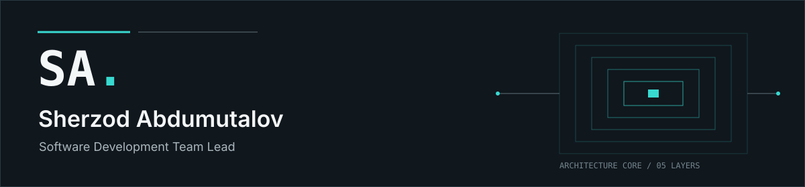

  

# Sherzod Abdumutalov

**Software Development Team Lead**

Backend engineering, software and solution architecture, technical leadership, GIS and data-intensive systems, product engineering, distributed systems, and open source.

## Engineering focus

- System and solution architecture
- Backend engineering and data architecture
- Technical leadership
- Distributed and event-driven systems
- GIS and data-intensive systems
- Product and open-source engineering

## Selected systems

**[WaterCadastre](https://suvkadastr.uz/)** 
*GovTech / GIS | Team Lead; Backend and Solution Architecture* 
A water-resource and cadastral information platform combining domain workflows with geospatial data management. The public engineering scope covers domain decomposition, data-intensive backend architecture, GIS, asynchronous processing, and technical leadership. 
Technology: Django, Django REST Framework, PostgreSQL/PostGIS, Redis, Celery.

**[Agro Platforma](https://agroplatforma.uz/)** 
*AgriTech / GovTech | Software Engineer* 
A multi-module agricultural operations platform combining operational workflows, reporting, and data-intensive backend work. The public contribution scope covers backend/API evolution, database-side operational reporting, and asynchronous workflow support. 
Technology: Django, Django REST Framework, PostgreSQL, Redis, Celery.

**Dcard** 
*Product Engineering | Project Initiator; Technical Product Lead; Solution Architect; Sole Backend and Web Engineer* 
A subscription-based digital discount and loyalty platform connecting users with partner offers. Backend and web ownership included server-side contracts and mobile integration boundaries; a dedicated mobile developer implemented the mobile applications. 
[Apple App Store](https://apps.apple.com/uz/app/dcard-%D0%B0%D0%B1%D0%BE%D0%BD%D0%B5%D0%BC%D0%B5%D0%BD%D1%82-%D0%BD%D0%B0-%D1%8D%D0%BA%D0%BE%D0%BD%D0%BE%D0%BC%D0%B8%D1%8E/id6759165589) | [Google Play](https://play.google.com/store/apps/details?id=com.xml.dcard)

**django-extensions** 
*Open Source | Contributor* 
A merged upstream contribution addressing specific Django 6 compatibility regressions while preserving compatibility with earlier supported Django versions. 
[Pull request #1979](https://github.com/django-extensions/django-extensions/pull/1979) | [Merged commit](https://github.com/django-extensions/django-extensions/commit/32ddfb0499bec7f39f9fbb44568d2781cecd1f32)

**Cocooning** 
*AgriTech / GovTech | Team Lead; Backend and Solution Architecture* 
An integrated sericulture operations management platform for digitizing operations and coordinating domain workflows across the production lifecycle.

**Logging & Fraud Detection** 
*Security / Observability | Project Initiator; Team Lead; Solution Architect* 
A reusable platform for centralized user activity logging, audit analysis, and fraud detection across multiple information systems, described publicly at the conceptual event-driven architecture level.

## Open-source contribution

[django-extensions PR #1979](https://github.com/django-extensions/django-extensions/pull/1979) delivered focused compatibility changes across signal receiver tuples, repeated `RandomCharField` pre-save behavior, version-aware `CheckConstraint` configuration, and `AutoField` / `BigAutoField` test expectations.

- Goal: support Django 6 while preserving compatibility with earlier supported Django versions
- Validation under Django 6.0.3: **533 passed, 4 skipped, 4 xfailed, 6 xpassed**
- Review: public maintainer approval; merged to `django-extensions:main` on May 21, 2026

## Technology focus

- **Backend:** Django, Django REST Framework, FastAPI
- **Data / GIS:** PostgreSQL, PostGIS, MongoDB
- **Async / Distributed:** Redis, Celery, RabbitMQ; event-driven and asynchronous processing
- **Product / Frontend:** React, server-rendered interfaces, backend/web platforms, mobile integration contracts

## Credentials

- IBM Back-End Development - IBM
- IELTS - Overall Band 6.0 - IDP Education Ltd

## Contact

- [LinkedIn](https://www.linkedin.com/in/sherzod-abdumutalov-809168224/)
- [Telegram: @asherzod1](https://t.me/asherzod1)
- [Phone: +998 77 707 70 09](tel:+998777077009)
- [GitHub: @asherzod1](https://github.com/asherzod1)
